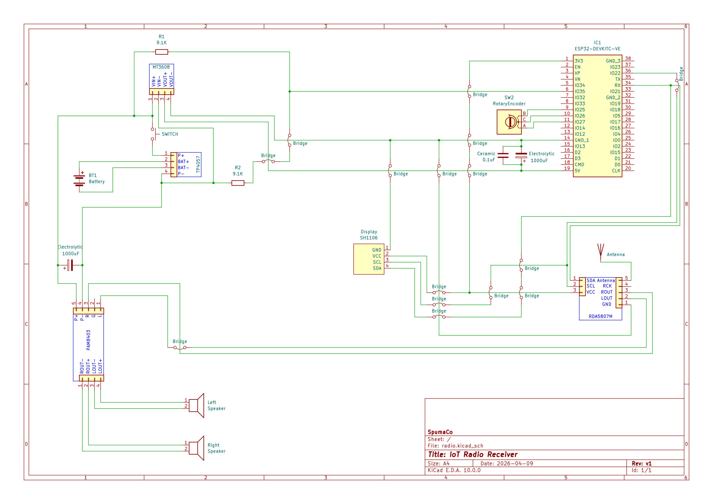

# ESP32 FM Radio 📻

A feature-rich, dual-core ESP32-based FM Radio player with an interactive OLED display, KY-040 rotary encoder control, and a sleek modern Web Dashboard accessible via a built-in Wi-Fi Access Point.

## 🌟 Key Features

- **High-Quality Radio Tuning:** Utilizes the RDA5807M FM tuner chip for stable frequency reception (87.5-108 MHz).
- **Responsive Web Dashboard:** A glassmorphism-styled Web UI running on Core 0 allows complete remote control from your smartphone, monitoring battery voltage, signal strength (RSSI), and signal validation status.
- **Hardware-Software Separation:** Seamlessly runs Wi-Fi and HTTP server tasks on Core 0, while keeping the UI and I2C tuning logic on Core 1 for buttery-smooth responsiveness.
- **Double-Click Service Menu:** Extensive on-device configuration:
  - Persistent, automatically generated randomized 8-digit Wi-Fi password stored via NVS (with reset option).
  - Screen Brightness/Contrast adjustment 
  - ADC Voltage Calibration/Offset compensation
  - Configurable Tuning Steps (50 kHz, 100 kHz, 200 kHz)
- **Deep Power Management:** Monitors battery voltage via ADC with low-voltage cutoff (Disables Radio at <3.0V).
- **Hardware Bounce Protection:** Uses PCNT hardware debouncing for robust rotary encoder accuracy.

## ⚙️ Hardware Components

- **ESP32** (e.g. WROOM-32 module)
- **RDA5807M** FM Tuner
- **SH1106 1.3" OLED Display** (I2C)
- **KY-040** Rotary Encoder
- **Battery System** (Using a standard 1:2 Voltage Divider on GPIO35)

## 🔌 Schematic



## 🚀 Building & Flashing

This project uses the standard ESP-IDF v6.x framework.

```bash
# Set up your ESP-IDF environment
get_idf

# Build the firmware, flash it over USB, and monitor serial output
idf.py build
idf.py -b 115200 flash monitor
```

## 🌐 Connecting to the Web Dashboard

1. Power on the ESP32.
2. The OLED screen will cycle between its own assigned IP `192.168.4.1` and the automatically generated Wi-Fi password (Wait for the 'IP' display mode).
3. Connect your smartphone to the `FM_RADIO_ESP32` Wi-Fi using the password displayed.
   *Note: Ensure your device does not disconnect due to "No Internet Connection", or simply disable Cellular Data momentarily.*
4. Open your browser and navigate to `http://192.168.4.1`.
5. Enjoy remote control over the tuning frequencies!

## 🔧 Operation & Controls

- **Rotate Encoder:** Tune Frequency up/down based on the configured Tuning Step.
- **Single Click:** Switch UI screen modes (Scale Mode, IP Mode, Telemetry Mode). 
- **Double Click:** Open the hidden __Service Menu__.

### Service Menu
Navigate the service menu by rotating the encoder, and apply the selection via a **single click**:
1. **Reset Wi-Fi Pass:** Deletes current password from memory and reboots the device.
2. **Brightness:** Real-time contrast adjustment (0-255).
3. **ADC Offset:** Compensate voltage readings in mV steps (helpful for 10k/10k resistor variations).
4. **Tuning Step:** Cycle between 50, 100, and 200 kHz.
5. *(Exiting back to main screen without saving is also possible via option 5)*.
